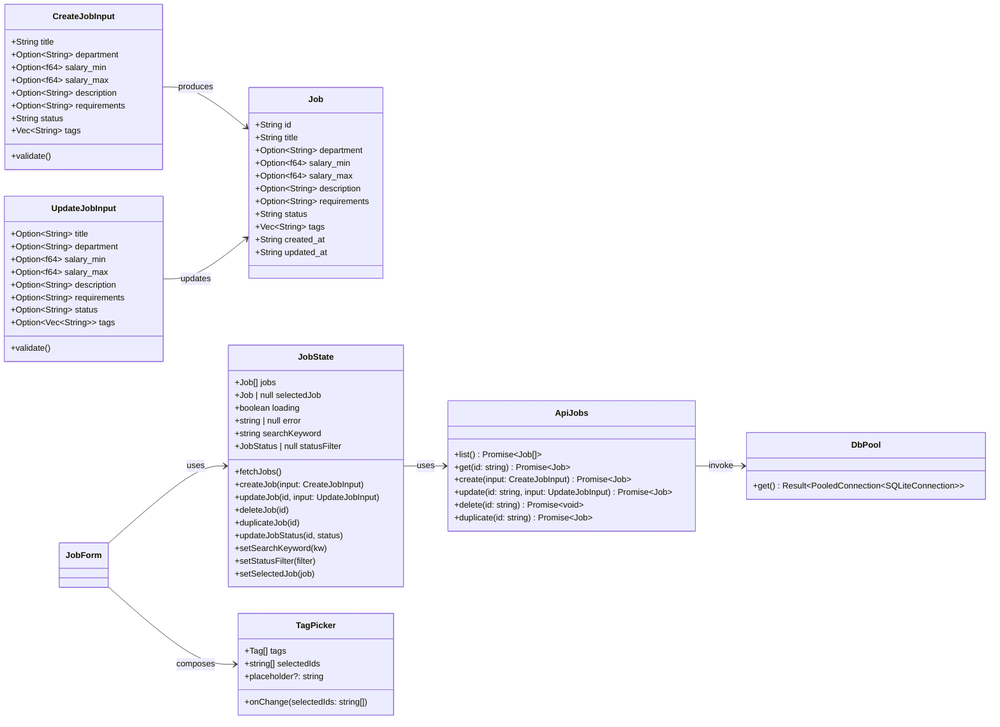
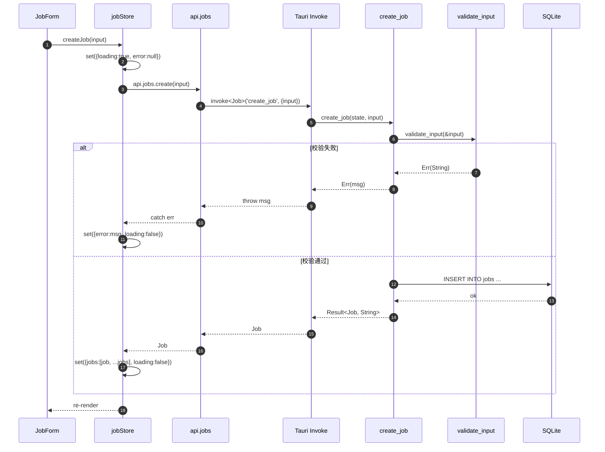
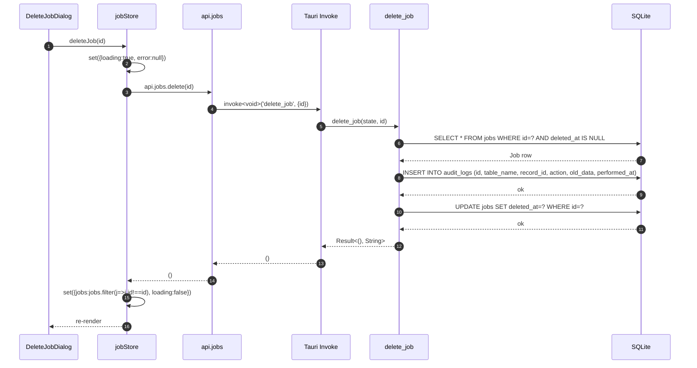
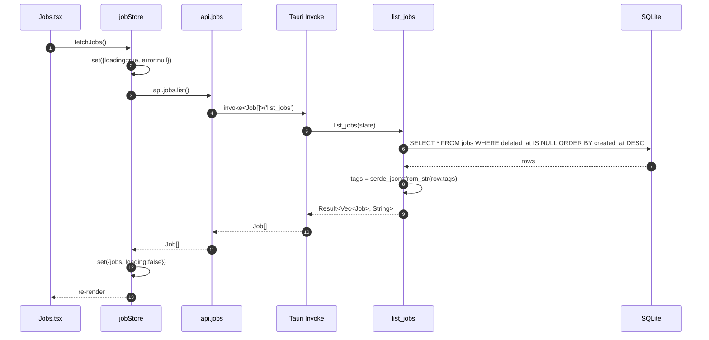

# ARCH-Step5: 职位 CRUD 增量架构设计

## 1. 实现方案

### 1.1 核心实现思路（对齐现有代码风格）

| P0 需求 | 实现思路 | 关键决策 |
|---------|---------|---------|
| P0-1 `jobs.rs` 6 个 commands | 完全复用 `tags.rs` 的 command 风格：`tauri::State<DbPool>` 获取连接池，错误处理采用 `.map_err(\|e\| { log::error!(...); msg })`，ID 使用 `nanoid::nanoid!()`，时间使用 `chrono::Local::now().to_rfc3339()` | `tags` 字段在 Rust 侧用 `serde_json::to_string`/`from_str` 与 DB JSON 文本互转 |
| P0-2 `list_jobs` 过滤与排序 | SQL 中显式 `WHERE deleted_at IS NULL ORDER BY created_at DESC`；返回前将 `tags` JSON 文本反序列化为 `Vec<String>` | 列表查询不加载 `deleted_at` 字段到 `Job` 结构体（前端类型中保留以兼容） |
| P0-3 `jobStore`（Zustand） | 完全对齐 `tagStore.ts` 模式：包含 `jobs`、`loading`、`error` 状态，每个异步 action 内部先 `set({loading:true})`，成功后更新列表，失败时 `set({error:msg})` | 新建/复制成功后 prepend 到列表；更新后替换列表中的对应项；删除后 filter |
| P0-4 `api.ts` 新增 `api.jobs` | 仿照 `api.tags` 命名空间，提供 `list / get / create / update / delete / duplicate` 方法，均通过 `invoke<T>(command_name, payload)` 调用 | `handleError` 工具函数已存在，可直接复用 |
| P0-5 `Jobs` 页面 | 重写 `Jobs.tsx`：顶部操作栏（搜索 + 状态筛选 + 新建按钮）+ 卡片网格列表。卡片内嵌状态切换 Select、复制按钮、删除按钮 | 卡片网格与 Dashboard 统计卡片风格一致，使用 `grid grid-cols-1 md:grid-cols-2 lg:grid-cols-3` |
| P0-6 删除二次确认 | 新建 `DeleteJobDialog` 组件，使用 shadcn/ui `Dialog`。文案按 PRD 第 4.3 节 | 点击确认后调用 `jobStore.deleteJob(id)` |
| P0-7 `TagPicker` 复用 | `JobForm` 中直接引入 `TagPicker`，传入 `tags`（来自 `useTagStore`）和 `selectedIds`/`onChange`。提交前 `tags` 已是 `string[]`，后端序列化为 JSON 文本存储 | 前后端各负责一层序列化：前端 `string[]` → Tauri invoke → 后端 `serde_json::to_string` → DB TEXT |
| P0-8 表单校验 | 后端 `create_job`/`update_job` 入口统一调用 `validate_input(&input)`（`validate.rs` 已 derive `Validate`）；前端表单对 `salary_max ≥ salary_min` 做额外提示 | 后端不增加跨字段校验，保持 `Validate` derive 简单 |
| P0-9 `lib.rs` 注册 | 在 `invoke_handler` 的 `generate_handler![]` 宏中追加 6 个 `commands::jobs::*` 函数 | 按字母顺序排列，保持可读性 |

### 1.2 P1 / P2 扩展思路

- **P1-1 / P1-2 搜索与筛选**：前端在 `jobStore` 中维护 `searchKeyword` 和 `statusFilter`，`list_jobs` 暂时返回全量（数据量可控），UI 用 `useMemo` 做前端过滤。后续若数据量大，再改为后端 SQL `LIKE` + `status = ?` 过滤。
- **P1-3 复制职位**：`duplicate_job` command 中，除标题加 `（副本）`、状态重置 `draft`、ID 与时间为新生成外，其余字段（部门、薪资、描述、要求、标签）全部复制。

## 2. 文件列表及相对路径

### 后端（Rust）—— 新建 / 修改

| 相对路径 | 操作 | 说明 |
|---------|------|------|
| `src-tauri/src/commands/jobs.rs` | **重写** | 实现 6 个 commands：`list_jobs`、`get_job`、`create_job`、`update_job`、`delete_job`、`duplicate_job` |
| `src-tauri/src/lib.rs` | **修改** | `invoke_handler` 中注册新增 6 个 commands |
| `src-tauri/src/validate.rs` | **确认/微调** | `CreateJobInput` / `UpdateJobInput` 已存在，确认字段与 PRD 一致即可 |
| `src-tauri/src/commands/mod.rs` | **确认** | 已包含 `pub mod jobs;`，无需改动 |

### 前端（React + TypeScript）—— 新建 / 修改

| 相对路径 | 操作 | 说明 |
|---------|------|------|
| `src/lib/api.ts` | **修改** | 新增 `api.jobs` 命名空间，暴露 6 个方法 |
| `src/types/index.ts` | **确认** | `Job`、`JobStatus` 等类型已定义，无需改动 |
| `src/stores/jobStore.ts` | **重写** | 从占位符改为完整 Zustand store，含 CRUD + loading/error |
| `src/hooks/useJobs.ts` | **修改/确认** | 若现有 hook 逻辑不足，同步调整以对接新 `jobStore` |
| `src/hooks/useDebounce.ts` | **复用** | 搜索框防抖直接复用，无需改动 |
| `src/components/jobs/JobForm.tsx` | **新建** | 新建/编辑职位的 Dialog 表单，含所有字段 + `TagPicker` |
| `src/components/jobs/JobCard.tsx` | **新建** | 职位卡片组件：展示标题、部门、薪资、状态标签、关联标签、操作按钮 |
| `src/components/jobs/DeleteJobDialog.tsx` | **新建** | 软删除二次确认弹窗 |
| `src/components/jobs/JobList.tsx` | **重写/移除** | 当前为占位组件，可重写为卡片网格容器，或直接在 `Jobs.tsx` 中内联 |
| `src/pages/Jobs.tsx` | **重写** | 职位管理主页面：操作栏 + 卡片网格 + 空状态 |
| `src/App.tsx` | **确认** | `/jobs` 路由已存在，无需改动 |
| `src/components/layout/PageLayout.tsx` | **复用** | 页面布局骨架，无需改动 |
| `src/components/ui/TagPicker.tsx` | **复用** | Step 4 已实现，直接复用 |

## 3. 数据结构和接口



## 4. 程序调用流程

### 4.1 创建职位（完整调用链）



### 4.2 删除职位（软删除 + 审计日志）



### 4.3 复制职位

```mermaid
sequenceDiagram
    autonumber
    participant UI as JobCard
    participant Store as jobStore
    participant API as api.jobs
    participant Inv as Tauri Invoke
    participant Cmd as duplicate_job
    participant DB as SQLite

    UI->>Store: duplicateJob(id)
    Store->>Store: set({loading:true, error:null})
    Store->>API: api.jobs.duplicate(id)
    API->>Inv: invoke<Job>('duplicate_job', {id})
    Inv->>Cmd: duplicate_job(state, id)
    Cmd->>DB: SELECT * FROM jobs WHERE id=? AND deleted_at IS NULL
    DB-->>Cmd: Job row
    Cmd->>Cmd: new_id = nanoid!(); title += "（副本）"; status = "draft"
    Cmd->>DB: INSERT INTO jobs (new record)
    DB-->>Cmd: ok
    Cmd-->>Inv: Result<Job, String>
    Inv-->>API: Job
    API-->>Store: Job
    Store->>Store: set({jobs:[job, ...jobs], loading:false})
    Store-->>UI: re-render
```

### 4.4 列表查询与加载



## 5. 任务列表（按依赖排序）

| 任务 ID | 任务名称 | 涉及文件 | 依赖 | 优先级 |
|---------|---------|---------|------|--------|
| **T01** | 后端基础设施与 Rust 业务层 | `src-tauri/src/lib.rs`<br>`src-tauri/src/validate.rs`<br>`src-tauri/src/commands/mod.rs`<br>`src-tauri/src/commands/jobs.rs` | 无 | **P0** |
| **T02** | 前端 API 与类型层 | `src/lib/api.ts`<br>`src/types/index.ts`<br>`src/lib/utils.ts`<br>`src/lib/constants.ts` | 无（与 T01 并行；命令签名已由 PRD 确定） | **P0** |
| **T03** | 前端状态层 | `src/stores/jobStore.ts`<br>`src/hooks/useJobs.ts`<br>`src/hooks/useDebounce.ts` | T02 | **P0** |
| **T04** | 前端 UI 组件层 | `src/components/jobs/JobForm.tsx`<br>`src/components/jobs/JobCard.tsx`<br>`src/components/jobs/DeleteJobDialog.tsx` | T03 | **P0** |
| **T05** | 前端页面集成 | `src/pages/Jobs.tsx`<br>`src/components/jobs/JobList.tsx`<br>`src/App.tsx`<br>`src/components/layout/PageLayout.tsx` | T04 | **P0** |

### 任务说明

- **T01**：后端一次性完成。重点在 `jobs.rs` 6 个 command 的实现，以及 `lib.rs` 的 `invoke_handler` 注册。`validate.rs` 已有 `CreateJobInput` / `UpdateJobInput`，只需确认字段覆盖完整。
- **T02**：前端接口层一次性完成。`api.ts` 新增 `api.jobs` 命名空间；`types/index.ts` 已完备，仅需确认对齐；`utils.ts` / `constants.ts` 按需补充辅助函数或状态常量。
- **T03**：状态管理重写。`jobStore.ts` 从当前占位符改为完整 Zustand store（对齐 `tagStore.ts`）；`useJobs.ts` 同步调整；`useDebounce.ts` 直接复用。
- **T04**：纯 UI 组件开发。3 个新组件：`JobForm`（Dialog 表单，含 `TagPicker`）、`JobCard`（卡片展示 + 行内操作）、`DeleteJobDialog`（二次确认）。
- **T05**：页面组装。重写 `Jobs.tsx` 为主页面，整合搜索、筛选、卡片网格、空状态；`JobList.tsx` 视情况重写为列表容器或内联到 `Jobs.tsx`；`App.tsx` 与 `PageLayout.tsx` 确认复用即可。

## 6. 依赖包列表

本次增量 **无需新增** npm 包或 Rust crate。现有依赖已覆盖全部需求：

### Rust（已存在）
- `serde_json`：用于 `tags` 字段的 JSON 序列化/反序列化
- `validator` + `validator_derive`：表单输入校验（`CreateJobInput` / `UpdateJobInput`）
- `nanoid`：生成唯一 ID
- `chrono`：生成 RFC 3339 时间戳
- `rusqlite` + `r2d2` + `r2d2_sqlite`：SQLite 连接池与查询
- `log` + `simplelog`：日志记录

### 前端（已存在）
- `zustand`：状态管理
- `@tauri-apps/api`：Tauri `invoke` 调用
- `lucide-react`：图标库
- Tailwind CSS + shadcn/ui 组件体系：样式与基础组件

## 7. 共享知识

### 7.1 Rust 侧共享模式
1. **错误处理统一模式**：
   ```rust
   .map_err(|e| {
       let msg = format!("Failed to ...: {}", e);
       log::error!("{}", msg);
       msg
   })?;
   ```
2. **连接池获取**：所有 command 第一行均为 `let conn = state.get().map_err(...)?;`
3. **ID 生成**：`let id = nanoid::nanoid!();`
4. **时间戳**：`let now = chrono::Local::now().to_rfc3339();`
5. **tags JSON 转换**：
   - 读：`let tags: Vec<String> = serde_json::from_str(&row_tags).unwrap_or_default();`
   - 写：`let tags_json = serde_json::to_string(&input.tags).unwrap_or_else(|_| "[]".to_string());`
6. **动态 UPDATE SQL**：仿照 `tags.rs` 的 `update_tag`，根据 `Option` 字段是否 `Some` 来拼接 SQL 片段和参数列表。

### 7.2 前端侧共享模式
1. **Zustand Store 模板**：
   ```typescript
   set({ loading: true, error: null });
   try {
     const result = await api.xxx.yyy(...);
     set({ ...newState, loading: false });
   } catch (err) {
     const msg = err instanceof Error ? err.message : String(err);
     set({ error: msg, loading: false });
   }
   ```
2. **API 调用格式**：`invoke<T>('command_name', { key: value })`
3. **JobStatus 合法值**：`'draft' | 'open' | 'paused' | 'closed'`
4. **TagPicker 复用**：
   ```tsx
   import TagPicker from '@/components/ui/TagPicker';
   // 需要先从 tagStore 获取全部 tags
   const { tags, fetchTags } = useTagStore();
   ```
5. **表单提交校验（前端额外）**：当 `salary_max` 与 `salary_min` 均填写时，需校验 `salary_max >= salary_min`，否则提示「薪资上限不能低于下限」。

### 7.3 数据库约定
- 软删除统一通过 `deleted_at IS NOT NULL` 标识
- `audit_logs` 表记录 `soft_delete` 操作，`old_data` 为被删记录的 JSON 快照
- `tags` 字段在 DB 中为 JSON 文本，默认 `'[]'`

## 8. 待明确事项（Q1-Q4 决策建议）

| 编号 | 问题 | 建议方案 | 备注 |
|------|------|---------|------|
| **Q1** | `salary_max` 是否必须在后端强制 `≥ salary_min`？ | **建议前端表单做此校验，后端不增加跨字段校验**。后端 `validate.rs` 保持 `Validate` derive 简单，仅校验单字段范围 `≥ 0`。 | 已在 `JobForm` 提交前校验，若 `salary_max < salary_min` 则阻止提交并提示。 |
| **Q2** | `duplicate_job` 复制范围？ | **全部复制**，仅标题加 `（副本）` 前缀、状态重置为 `draft`、ID 与 `created_at`/`updated_at` 为新生成。 | 标签、部门、薪资、描述、要求均原样复制。 |
| **Q3** | 状态切换交互方式？ | **列表页行内 Select 下拉快速切换**。用户直接在 `JobCard` 的状态标签处点击展开 Select，选择新状态后立即调用 `jobStore.updateJobStatus(id, newStatus)`。 | 无需打开 `JobForm`，减少操作步骤。 |
| **Q4** | 列表页布局？ | **卡片网格布局**（`grid` 响应式），与 Dashboard 统计卡片风格保持一致。每张卡片展示标题、部门、薪资、状态、标签、操作按钮。 | 若后续字段继续膨胀，可无缝切换为表格布局；当前卡片更利于标签色块和状态徽章的展示。 |

---

**版本**: Step 5  
**日期**: 2025-05-14  
**依赖**: Step 4（TagPicker、tags.rs 模式、现有数据库 Schema）
