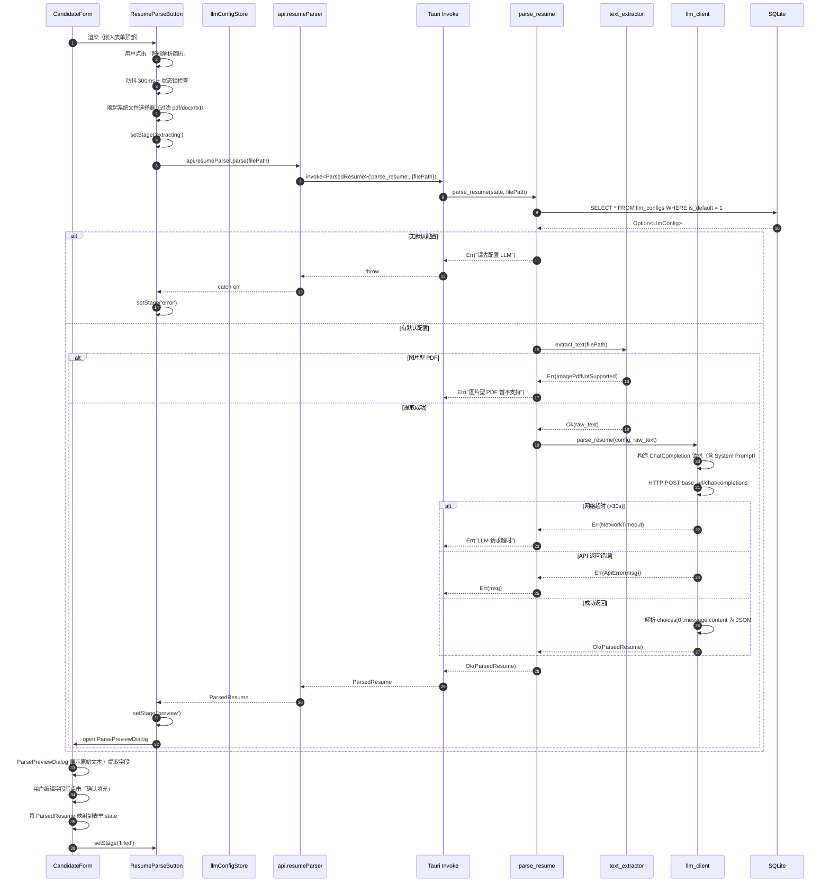
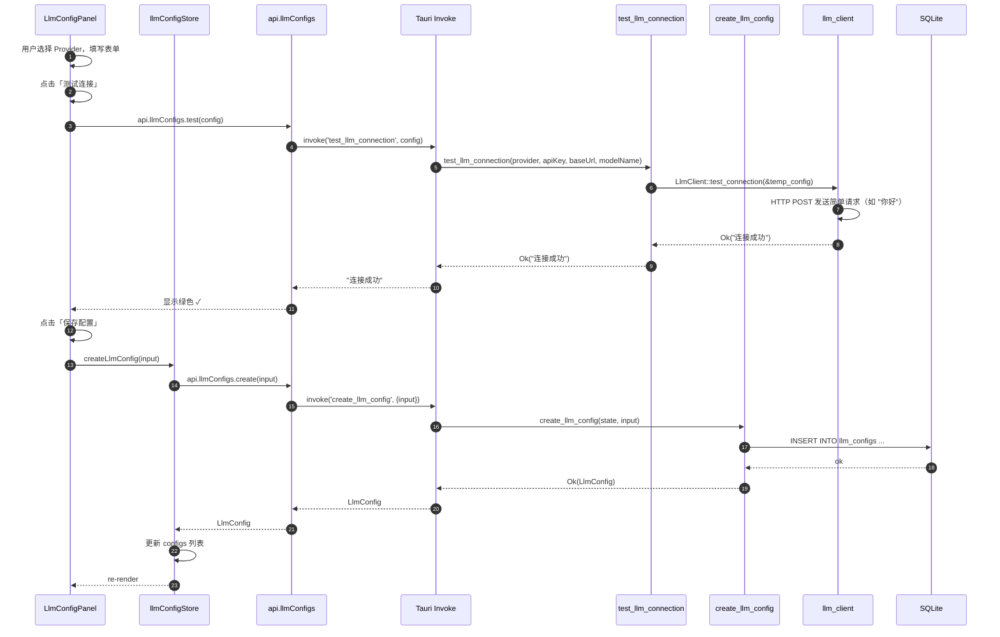
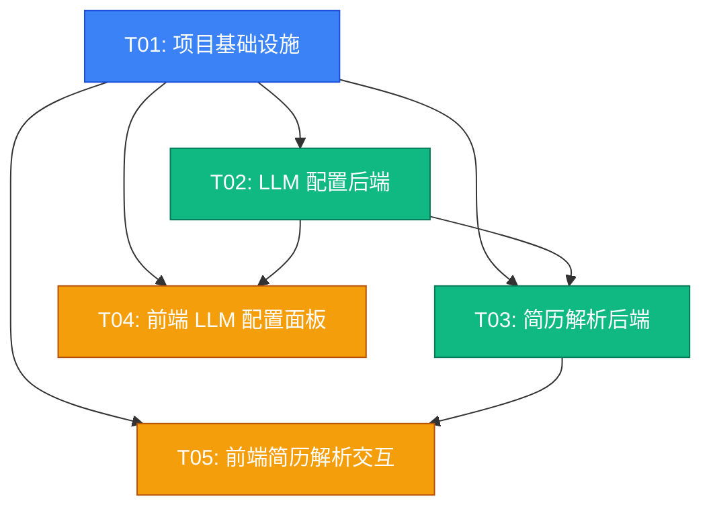
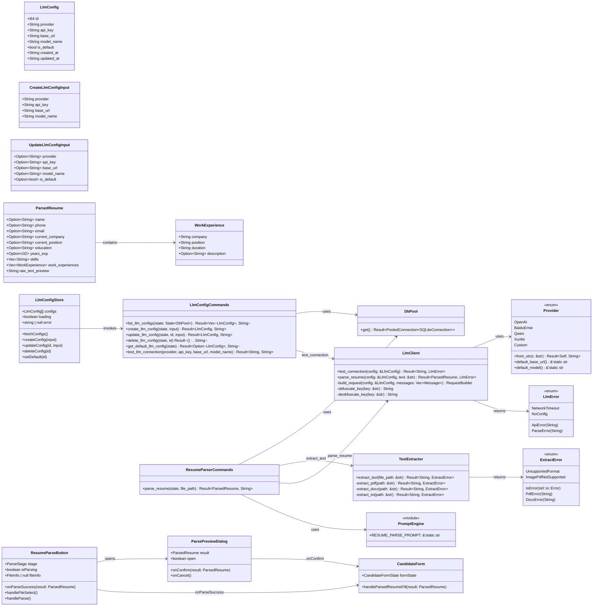

# ARCH-Step24: 智能简历解析 增量架构设计

## 1. 实现方案概述

Step 24 的核心挑战是**将本地 PDF/DOCX/TXT 简历通过 LLM API 转换为结构化候选人数据**。后端引入 `services/` 服务层解耦文本提取、Prompt 构造和 LLM HTTP 调用；前端在 Settings 新增「LLM 配置」Tab，在 CandidateForm 新增「智能解析」入口。API Key 采用 SQLite 存储 + 简单 XOR 混淆，避免引入 Tauri secure-store 额外依赖。HTTP 请求超时 30s，整体解析流程（含文本提取）超时 60s，失败直接报错不重试。Prompt P0 硬编码在 Rust 源码中，同时要求中英文提取，不做自动语言检测。图片型 PDF 暂不支持，预留 `ImagePdfNotSupported` 错误类型。

---

## 2. 新增/修改文件列表

### 后端（Rust）

| 相对路径 | 操作 | 说明 |
|---------|------|------|
| `src-tauri/Cargo.toml` | **修改** | 新增 `reqwest`、`pdf-extract`、`docx-rs`、`thiserror` 依赖 |
| `src-tauri/src/db/migrations/V5__add_llm_configs.sql` | **新增** | `llm_configs` 表 + 更新触发器 |
| `src-tauri/src/lib.rs` | **修改** | `invoke_handler` 注册新增 7 个 commands |
| `src-tauri/src/commands/mod.rs` | **修改** | 新增 `pub mod llm_configs;`、`pub mod resume_parser;` |
| `src-tauri/src/commands/llm_configs.rs` | **新增** | `list_llm_configs`、`create_llm_config`、`update_llm_config`、`delete_llm_config`、`get_default_llm_config`、`test_llm_connection` |
| `src-tauri/src/commands/resume_parser.rs` | **新增** | `parse_resume` 主入口：接收文件路径 → 提取文本 → 调用 LLM → 返回 `ParsedResume` |
| `src-tauri/src/services/mod.rs` | **新增** | 服务模块聚合导出 |
| `src-tauri/src/services/llm_client.rs` | **新增** | Provider 枚举、`LlmClient` 统一接口、各 Provider HTTP 请求构造、连接测试、API Key XOR 混淆/解混淆 |
| `src-tauri/src/services/text_extractor.rs` | **新增** | PDF(`pdf-extract`)、DOCX(`docx-rs`)、TXT 文本提取，返回 `Result<String, ExtractError>` |
| `src-tauri/src/services/prompt.rs` | **新增** | 硬编码 System Prompt 常量，要求 LLM 返回固定 JSON Schema |

### 前端（React + TypeScript）

| 相对路径 | 操作 | 说明 |
|---------|------|------|
| `src/types/index.ts` | **修改** | 新增 `LlmConfig`、`ParsedResume`、`ProviderType`、`ParseStage` 类型 |
| `src/lib/api.ts` | **修改** | 新增 `api.llmConfigs` 和 `api.resumeParser` 命名空间 |
| `src/stores/llmConfigStore.ts` | **新增** | Zustand store：配置列表、CRUD action、loading/error 状态 |
| `src/pages/Settings.tsx` | **修改** | 新增「LLM 配置」Tab（设置页第四个 Tab） |
| `src/components/settings/LlmConfigPanel.tsx` | **新增** | LLM 配置主面板：Provider 选择器、表单输入、测试/保存/设为默认按钮 |
| `src/components/settings/LlmConfigCard.tsx` | **新增** | 已保存配置卡片（P1 配置列表），支持编辑/删除/默认标记 |
| `src/components/candidates/ResumeParseButton.tsx` | **新增** | 智能解析按钮：唤起文件选择器、展示文件信息、进度条/步骤条、防抖 300ms |
| `src/components/candidates/ParsePreviewDialog.tsx` | **新增** | 解析结果预览弹窗：左侧原始文本摘要、右侧提取字段、可编辑、确认/取消 |
| `src/components/candidates/CandidateForm.tsx` | **修改** | 顶部嵌入 `ResumeParseButton`，接收 `ParsedResume` 回填表单 state |

---

## 3. 数据结构与接口设计

### 3.1 Rust 数据结构

```rust
// commands/llm_configs.rs
#[derive(Debug, Serialize, Deserialize, Clone)]
#[serde(rename_all = "camelCase")]
pub struct LlmConfig {
    pub id: i64,
    pub provider: String,      // "openai" | "baidu_ernie" | "qwen" | "xunfei" | "custom"
    pub api_key: String,       // XOR 混淆后存储，返回前端时再次混淆（前端不展示真实 key）
    pub base_url: String,
    pub model_name: String,
    pub is_default: bool,
    pub created_at: String,
    pub updated_at: String,
}

#[derive(Debug, Deserialize)]
#[serde(rename_all = "camelCase")]
pub struct CreateLlmConfigInput {
    pub provider: String,
    pub api_key: String,
    pub base_url: String,
    pub model_name: String,
}

#[derive(Debug, Deserialize)]
#[serde(rename_all = "camelCase")]
pub struct UpdateLlmConfigInput {
    pub provider: Option<String>,
    pub api_key: Option<String>,
    pub base_url: Option<String>,
    pub model_name: Option<String>,
    pub is_default: Option<bool>,
}

// commands/resume_parser.rs
#[derive(Debug, Serialize)]
#[serde(rename_all = "camelCase")]
pub struct ParsedResume {
    pub name: Option<String>,
    pub phone: Option<String>,
    pub email: Option<String>,
    pub current_company: Option<String>,
    pub current_position: Option<String>,
    pub education: Option<String>,
    pub years_exp: Option<i32>,
    pub skills: Vec<String>,
    pub work_experiences: Vec<WorkExperience>,
    pub raw_text_preview: String,  // 前 1000 字符，用于前端预览
}

#[derive(Debug, Serialize)]
#[serde(rename_all = "camelCase")]
pub struct WorkExperience {
    pub company: String,
    pub position: String,
    pub duration: String,
    pub description: Option<String>,
}

// services/llm_client.rs
#[derive(Debug, Clone, Copy, PartialEq)]
pub enum Provider {
    OpenAI,
    BaiduErnie,
    Qwen,
    Xunfei,
    Custom,
}

impl Provider {
    pub fn from_str(s: &str) -> Result<Self, String>;
    pub fn default_base_url(&self) -> &'static str;
    pub fn default_model(&self) -> &'static str;
}

#[derive(Debug, thiserror::Error)]
pub enum LlmError {
    #[error("网络请求超时")]
    NetworkTimeout,
    #[error("API 错误: {0}")]
    ApiError(String),
    #[error("响应解析失败: {0}")]
    ParseError(String),
    #[error("未找到默认 LLM 配置")]
    NoConfig,
}

pub struct LlmClient;
impl LlmClient {
    /// 使用给定配置测试连接（发送简单请求）
    pub async fn test_connection(config: &LlmConfig) -> Result<String, LlmError>;
    /// 调用 LLM 解析简历文本
    pub async fn parse_resume(config: &LlmConfig, text: &str) -> Result<ParsedResume, LlmError>;
}

// services/text_extractor.rs
#[derive(Debug, thiserror::Error)]
pub enum ExtractError {
    #[error("不支持的文件格式")]
    UnsupportedFormat,
    #[error("图片型 PDF 暂不支持")]
    ImagePdfNotSupported,
    #[error("文件读取失败: {0}")]
    IoError(#[from] std::io::Error),
    #[error("PDF 解析失败: {0}")]
    PdfError(String),
    #[error("DOCX 解析失败: {0}")]
    DocxError(String),
}

pub fn extract_text(file_path: &str) -> Result<String, ExtractError>;
```

### 3.2 Tauri Command 列表

```rust
// ===== llm_configs.rs =====

#[tauri::command]
pub fn list_llm_configs(
    state: tauri::State<DbPool>
) -> Result<Vec<LlmConfig>, String>;

#[tauri::command]
pub fn create_llm_config(
    state: tauri::State<DbPool>,
    input: CreateLlmConfigInput
) -> Result<LlmConfig, String>;

#[tauri::command]
pub fn update_llm_config(
    state: tauri::State<DbPool>,
    id: i64,
    input: UpdateLlmConfigInput
) -> Result<LlmConfig, String>;

#[tauri::command]
pub fn delete_llm_config(
    state: tauri::State<DbPool>,
    id: i64
) -> Result<(), String>;

#[tauri::command]
pub fn get_default_llm_config(
    state: tauri::State<DbPool>
) -> Result<Option<LlmConfig>, String>;

/// 测试连接（无需先保存，支持前端表单直接测试）
#[tauri::command]
pub async fn test_llm_connection(
    provider: String,
    api_key: String,
    base_url: String,
    model_name: String
) -> Result<String, String>;

// ===== resume_parser.rs =====

/// 主解析入口。异步 command，内部通过 DbPool 获取默认配置，再串行执行：
/// 提取文本 → 构造 Prompt → 调用 LLM → 解析 JSON → 构造 ParsedResume
#[tauri::command]
pub async fn parse_resume(
    state: tauri::State<'_, DbPool>,
    file_path: String
) -> Result<ParsedResume, String>;
```

### 3.3 前端 TypeScript 类型补充

```typescript
// src/types/index.ts 新增

export type ProviderType =
  | 'openai'
  | 'baidu_ernie'
  | 'qwen'
  | 'xunfei'
  | 'custom';

export interface LlmConfig {
  id: number;
  provider: ProviderType;
  apiKey: string;       // 混淆后的 key，前端仅作回显/传递，不做解密
  baseUrl: string;
  modelName: string;
  isDefault: boolean;
  createdAt: string;
  updatedAt: string;
}

export interface WorkExperience {
  company: string;
  position: string;
  duration: string;
  description?: string;
}

export interface ParsedResume {
  name: string | null;
  phone: string | null;
  email: string | null;
  currentCompany: string | null;
  currentPosition: string | null;
  education: string | null;
  yearsExp: number | null;
  skills: string[];
  workExperiences: WorkExperience[];
  rawTextPreview: string;
}

export type ParseStage =
  | 'idle'
  | 'selecting'
  | 'extracting'
  | 'parsing'
  | 'preview'
  | 'filled'
  | 'error';
```

---

## 4. 程序调用流程

### 4.1 时序图：简历智能解析完整流程



### 4.2 时序图：LLM 配置保存与测试



---

## 5. 依赖包列表

### Rust Crates（Cargo.toml 新增）

```toml
[dependencies]
# 已存在依赖略...
reqwest = { version = "0.12", features = ["json"] }   # HTTP 客户端，支持 JSON 和超时
pdf-extract = "0.7"                                     # PDF 文本提取
docx-rs = "0.4"                                         # DOCX 文本提取
thiserror = "1.0"                                       # 错误枚举宏
```

> **说明**：Tauri 2 内部已运行 Tokio Runtime，`reqwest` 在 async command 中可直接使用，无需额外引入 `tokio` crate。`serde` / `serde_json` / `chrono` / `rusqlite` 等已存在于现有 `Cargo.toml`。

### npm packages

Step 24 前端**不引入新的 npm 依赖**。复用现有技术栈：
- `react` / `react-dom`（已有）
- `@tauri-apps/api`（已有，调用 dialog + invoke）
- `zustand`（已有，状态管理）
- `tailwindcss` / `shadcn/ui`（已有，样式）
- `lucide-react`（已有，图标）

防抖直接复用现有 `src/hooks/useDebounce.ts`。

---

## 6. 任务列表（按依赖排序，不超过 5 个）

| 任务 ID | 任务名称 | 涉及文件 | 依赖 | 优先级 |
|---------|---------|---------|------|--------|
| **T01** | **项目基础设施** | `src-tauri/Cargo.toml`、`src-tauri/src/db/migrations/V5__add_llm_configs.sql`、`src-tauri/src/lib.rs`、`src-tauri/src/commands/mod.rs`、`src/types/index.ts`、`src/lib/api.ts` | 无 | P0 |
| **T02** | **LLM 配置后端** | `src-tauri/src/commands/llm_configs.rs`、`src-tauri/src/services/mod.rs`、`src-tauri/src/services/llm_client.rs`、`src/stores/llmConfigStore.ts` | T01 | P0 |
| **T03** | **简历解析后端** | `src-tauri/src/services/text_extractor.rs`、`src-tauri/src/services/prompt.rs`、`src-tauri/src/commands/resume_parser.rs` | T01, T02 | P0 |
| **T04** | **前端 LLM 配置面板** | `src/components/settings/LlmConfigPanel.tsx`、`src/components/settings/LlmConfigCard.tsx`、`src/pages/Settings.tsx` | T01, T02 | P0 |
| **T05** | **前端简历解析交互** | `src/components/candidates/ResumeParseButton.tsx`、`src/components/candidates/ParsePreviewDialog.tsx`、`src/components/candidates/CandidateForm.tsx` | T01, T03 | P0 |

### 各任务详细说明

#### T01 项目基础设施
- **Cargo.toml**：追加 `reqwest`、`pdf-extract`、`docx-rs`、`thiserror`。
- **V5__add_llm_configs.sql**：按 PRD 5.1 节建表 + 触发器。
- **lib.rs**：在 `invoke_handler![]` 中注册 7 个新 command。
- **commands/mod.rs**：暴露 `llm_configs`、`resume_parser` 子模块。
- **types/index.ts**：追加 `ProviderType`、`LlmConfig`、`ParsedResume`、`WorkExperience`、`ParseStage`。
- **api.ts**：追加 `api.llmConfigs`（list/create/update/delete/getDefault/test）和 `api.resumeParser`（parse）。

#### T02 LLM 配置后端
- **llm_configs.rs**：实现 CRUD command + `get_default_llm_config` + `test_llm_connection`。`is_default` 切换时通过事务保证唯一性。`api_key` 写入前 XOR 混淆，读出后保持混淆（前端不解密）。
- **services/llm_client.rs**：定义 `Provider` 枚举及默认 URL/模型；`LlmClient` 统一封装 HTTP 请求（OpenAI 兼容格式为主，百度 ERNIE 额外处理 access token）；实现 `test_connection`（发送简单问候）和 `parse_resume`（构造 messages 数组，设置 `response_format: {type: "json_object"}` 或直接用 JSON system prompt）。HTTP 超时 30s。
- **llmConfigStore.ts**：对标现有 `tagStore.ts`，维护 `configs`、`loading`、`error`，提供 `fetchConfigs`、`createConfig`、`updateConfig`、`deleteConfig`、`setDefault`。

#### T03 简历解析后端
- **text_extractor.rs**：根据文件扩展名分发：`.pdf` → `pdf-extract`；`.docx` → `docx-rs` 读取 paragraphs；`.txt` → `std::fs::read_to_string`。PDF 提取无文本内容时返回 `ImagePdfNotSupported`。
- **prompt.rs**：定义 `RESUME_PARSE_PROMPT: &str` 常量。System Prompt 明确要求 LLM 返回 JSON，字段包含 `name`、`phone`、`email`、`current_company`、`current_position`、`education`、`years_exp`（number）、`skills`（string[]）、`work_experiences`（数组）。同时说明支持中英文简历。
- **resume_parser.rs**：`parse_resume` 为 async command。流程：从 DbPool 获取默认配置 → 调用 `extract_text` → 调用 `LlmClient::parse_resume` → 解析 LLM 返回的 JSON 为 `ParsedResume`（含 `raw_text_preview` 截断前 1000 字符）。所有错误统一映射为 `String` 返回前端。

#### T04 前端 LLM 配置面板
- **LlmConfigPanel.tsx**：设置页第四个 Tab 的内容。Provider Select 切换时自动填充默认 baseUrl 和 modelName（允许用户覆盖）。API Key 为 password input + 显示/隐藏切换。底部「测试连接」「保存配置」「设为默认」按钮。
- **LlmConfigCard.tsx**（P1 配置列表）：展示已保存配置，标记默认，支持编辑和删除。
- **Settings.tsx**：重构为 Tab 布局（或保持现有 section 风格新增 LLM 配置 section），引入 `LlmConfigPanel`。

#### T05 前端简历解析交互
- **ResumeParseButton.tsx**：嵌入 `CandidateForm` 顶部。点击后调用 `open({filters: [{name: '简历', extensions: ['pdf','docx','txt']}]})` 获取文件路径。解析过程使用 `ParseStage` 状态机驱动 UI：显示进度条/步骤条（提取中 → 解析中 → 完成）。防抖 300ms + `isParsing` 状态锁防止重复提交。
- **ParsePreviewDialog.tsx**：Dialog/Drawer 布局。左侧 `rawTextPreview`（前 1000 字符，可展开），右侧表单展示提取字段（姓名、电话、邮箱、工作年限、技能、教育、工作经历），每个字段可手动编辑。底部「确认填充」将数据回写到父组件表单 state，「取消」丢弃。
- **CandidateForm.tsx**：在表单顶部新增「智能解析」区域，接收 `ParsedResume` 后映射到各表单字段（字段存在则覆盖，不存在则保留原值）。

---

## 7. 共享知识（跨文件约定）

### 7.1 Provider 标识与默认值

Provider 标识字符串（Rust/TS 通用）：
| Provider | ID 字符串 | 默认 Base URL | 默认模型 |
|----------|----------|---------------|---------|
| OpenAI | `openai` | `https://api.openai.com/v1` | `gpt-4o-mini` |
| 百度 ERNIE | `baidu_ernie` | `https://aip.baidubce.com/rpc/2.0/ai_custom/v1/wenxinworkshop/chat` | `ernie-speed-128k` |
| 通义千问 | `qwen` | `https://dashscope.aliyuncs.com/compatible-mode/v1` | `qwen-turbo` |
| 讯飞星火 | `xunfei` | `https://spark-api-open.xf-yun.com/v1` | `lite` |
| 自定义 | `custom` | 手动输入 | 手动输入 |

**约定位置**：Rust 侧放在 `services/llm_client.rs` 的 `Provider` 实现中；前端侧在 `LlmConfigPanel.tsx` 中定义常量对象，与 Rust 保持字符串一致。

### 7.2 API Key 安全策略

- **存储**：SQLite `llm_configs.api_key` 字段保存 **XOR 混淆后**的字符串。
- **混淆算法**：固定 salt = `b"TalentVaultStep24"`，循环 XOR。代码位于 `services/llm_client.rs` 的 `obfuscate_key / deobfuscate_key` 私有函数。
- **前端行为**：前端从不接触真实 API Key。`api.ts` 中的 `api.llmConfigs.list` 返回的 `apiKey` 仍是混淆态；编辑时回显混淆态；保存时若用户修改则传递新值，后端重新混淆。测试连接时传递原始 key（HTTPS 传输）。
- **理由**：本地单用户应用，避免过度工程。Tauri secure-store 需额外插件和平台适配，增加构建复杂度。

### 7.3 错误码与提示映射

后端所有 command 返回 `Result<T, String>`，错误字符串直接作为前端提示文案。约定如下：

| 错误场景 | 后端返回字符串 | 前端展示 |
|---------|--------------|---------|
| 无默认 LLM 配置 | `请先配置 LLM` | 弹窗引导用户去设置页 |
| 网络超时 | `LLM 请求超时，请检查网络` | 红色提示 + 重试按钮 |
| API Key 无效 | `API 认证失败：{provider} 返回 401` | 红色提示，建议检查 Key |
| 图片型 PDF | `图片型 PDF 暂不支持` | 黄色警告，建议手动录入 |
| 文件格式不支持 | `不支持的文件格式` | 红色提示 |
| JSON 解析失败 | `LLM 返回格式异常，请重试` | 红色提示 + 重试按钮 |

### 7.4 Prompt 模板位置与格式

- **位置**：`src-tauri/src/services/prompt.rs`
- **形式**：`const RESUME_PARSE_PROMPT: &str = r#"..."#;`
- **内容要点**：
  1. 角色设定：「你是一名简历解析助手」。
  2. 输出格式：严格 JSON，不要 markdown 代码块。
  3. 字段说明：中英文简历均可，缺失字段填 `null` 或空数组。
  4. `years_exp` 为数字（整数），`skills` 为字符串数组，`work_experiences` 为对象数组。

### 7.5 文件路径传递约定

- 前端通过 `@tauri-apps/api/dialog` 的 `open()` 获取绝对路径（字符串）。
- 将路径字符串通过 `invoke('parse_resume', { filePath })` 传递给后端。
- **后端负责**：`std::fs::read` / `pdf-extract` / `docx-rs` 读取实际文件内容。前端不读取文件二进制。

### 7.6 状态管理约定

- `ParseStage` 状态机定义 idle → selecting → extracting → parsing → preview → filled → error 的流转。
- `ResumeParseButton.tsx` 内部维护 `stage` 和 `isParsing` state，不放入全局 store（解析是局部操作）。
- `llmConfigStore.ts` 全局管理配置列表（多个页面可能读取默认配置）。

---

## 8. 任务依赖图



---

## 9. 待明确事项（Q1–Q7 决策）

| 编号 | 问题 | 决策 | 理由 |
|------|------|------|------|
| **Q-1** | API Key 如何安全存储？ | **sqlite 存储 + XOR 简单混淆**。salt 固定为 `TalentVaultStep24`，循环 XOR 后存 TEXT 字段。 | 本地单用户应用，用户自担设备安全风险。避免引入 Tauri secure-store 额外插件及其平台适配成本，保持构建简单。 |
| **Q-2** | LLM 调用超时时间？ | **HTTP 请求超时 30s；整体解析流程（含文本提取）总超时 60s**。`reqwest::ClientBuilder::timeout(Duration::from_secs(30))`。 | 30s 足够普通简历（<10 页）的 LLM 响应；60s 总上限给文本提取和 JSON 解析留余量。 |
| **Q-3** | 重试策略？ | **不重试**。网络超时或 5xx 直接返回错误，由前端提示用户手动重试。 | 保持实现简单；LLM API 调用成本敏感，自动重试可能导致意外费用。错误提示清晰即可。 |
| **Q-4** | Prompt 是否硬编码？ | **P0 硬编码**，放在 `src-tauri/src/services/prompt.rs` 作为 `const RESUME_PARSE_PROMPT: &str`。 | Step 24 范围控制。P2 如需自定义 Prompt，再改为数据库存储 + 编辑器 UI。硬编码保证输出格式稳定可控。 |
| **Q-5** | 解析失败时是否保留原始文本？ | **不保留**。解析失败直接返回错误，不写入日志表或临时文件。 | 减少数据膨胀和实现复杂度。用户可重新上传重试。P2 如需解析历史，再新增 `parse_logs` 表。 |
| **Q-6** | 多语言简历支持？ | **P0 不做自动语言检测**。System Prompt 中明确说明「支持中英文简历提取」，由 LLM 自行处理。 | 自动语言检测增加复杂度和依赖（如 `whatlang`），收益有限。主流 LLM（GPT-4o、ERNIE、Qwen）均具备多语言理解能力。 |
| **Q-7** | 是否支持图片型 PDF（扫描件）？ | **不支持**。`text_extractor.rs` 中 PDF 提取无文本时返回 `ImagePdfNotSupported` 错误。 | 图片型 PDF 需要 OCR（如 Tesseract 或云端 OCR），超出 Step 24 范围。预留 `ImagePdfNotSupported` 错误类型，P3 可扩展为调用 OCR 服务。 |

---

## 10. 类图（Class Diagram）

> 以下类图完整描述新增模块的结构与关系。详见独立文件 `docs/class-diagram-step24.mermaid`。


